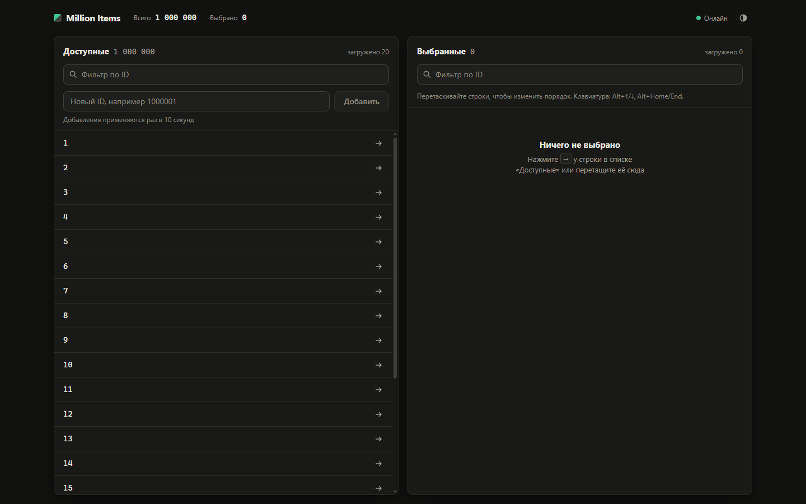

# Million Items Manager

**Русский** · [English](README.en.md)

Тестовое задание: два списка над миллионом элементов (ID от 1 до 1 000 000). В левом всё, что не выбрано, в правом выбранные. Выбранные можно сортировать перетаскиванием, оба списка фильтруются по ID и подгружаются порциями по 20. Состояние хранится на сервере и общее для всех, кто открыл приложение: если открыть две вкладки, изменения из одной видны в другой примерно через секунду.

- Исходный код: https://github.com/NikolayYaroslavcev/million-items-manager
- Live demo: https://million-items-manager.onrender.com



Стек: Express и TypeScript на сервере, React и Vite на клиенте, dnd-kit для перетаскивания, zod для схем, общих у клиента и сервера. Тесты на Vitest и Playwright, монорепозиторий на pnpm.

## Запуск

Нужны Node.js 22.12 или новее (версия есть в `.nvmrc`) и pnpm 11. Проще всего включить его через `corepack enable`.

```bash
pnpm i
pnpm dev                 # сервер на :3000 и Vite на :5173, /api проксируется на сервер
pnpm build && pnpm start # production: один процесс отдаёт и API, и собранный фронт на :3000
```

Через Docker:

```bash
docker build -t mim . && docker run -p 8080:8080 mim   # потом открыть http://localhost:8080
```

Все настройки задаются переменными окружения, список лежит в [.env.example](.env.example). `DEBUG_ENDPOINTS` и `SEED_SELECTED` нужны только для замеров производительности. Если включить их при `NODE_ENV=production`, сервер откажется стартовать, чтобы их нельзя было случайно оставить на проде.

## Тесты

```bash
pnpm check               # lint, prettier, typecheck и unit/integration-тесты всех пакетов
pnpm test:large          # серверные тесты на полном наборе в миллион элементов
pnpm test:e2e            # сборка и Playwright против настоящего production-сервера
pnpm test:perf           # замеры в браузере, результат пишется в apps/web/perf-results.json
pnpm smoke http://localhost:3000          # быстрая проверка живого сервера (подходит и для прода)
pnpm smoke https://<host> --long          # то же плюс 5 минут тишины в SSE, чтобы проверить прокси
pnpm build && pnpm --filter @mim/server load --duration 60 --connections 200   # нагрузочный тест
```

Перед первым `pnpm test:e2e` нужно один раз поставить браузер: `pnpm --filter @mim/web exec playwright install chromium`.

GitHub Actions запускает всё то же самое: проверки и тесты, e2e, минутную нагрузку на 200 соединений и сборку Docker-образа со smoke-тестом и проверкой корректной остановки.

## Как устроено

```
packages/shared   zod-схемы, коды ошибок, типы ответов и событий, общие константы
apps/server
  src/store       структуры данных: битовая карта выбранных и B+-дерево ключей порядка
  src/core        движок тиков, очереди, идемпотентность, SSE, курсоры
  src/http        Express: маршруты, валидация, rate limit, ошибки
  src/runtime.ts  сборка сервисов, graceful shutdown
  test/           unit, property, integration, внедрение сбоев; test/large на миллион элементов
apps/web
  src/sync        синхронизация без React: зеркало списка, очередь своих операций, SSE, опрос, лидер вкладок
  src/api         HTTP-клиент с таймаутами и повторами
  src/ui          виртуализированные списки, перетаскивание, клавиатура, добавление ID
  test/, e2e/     unit-тесты и сценарии Playwright
```

Сервер не хранит миллион объектов. Базовый диапазон 1..1 000 000 вычисляется на лету, выбор хранится битовой картой, а порядок выбранных задаётся строковыми ключами в B+-дереве. Перенос элемента меняет один ключ, остальные сдвигать не нужно. Если между соседями не осталось места для нового ключа, сервер перегенерирует ключи только в небольшой окрестности, на миллионе выбранных это около 1,6 мс.

Запросы копятся в очереди и обрабатываются раз в секунду, добавление новых ID раз в 10 секунд, как требует ТЗ. Внутри тика сначала идут добавления, потом изменения в порядке поступления, потом чтения, поэтому каждая страница отражает одну версию данных. Одинаковые чтения в одном тике выполняются один раз. Каждая мутация несёт `Idempotency-Key`: если клиент повторил запрос после таймаута, операция не применится второй раз.

Все изменения пишутся в журнал с номером версии. Клиент получает их по SSE, а если SSE не работает, опрашивает `/api/changes`. Вкладки одного браузера договариваются между собой, и соединение держит только одна из них. На клиенте список хранится как загруженное окно плюс журнал изменений, так что при прокрутке списка, который в это время меняют другие, элементы не пропадают и не дублируются.

Состояние живёт в памяти процесса, как разрешает ТЗ. При перезапуске сервера открытые вкладки это замечают (в каждом ответе есть идентификатор процесса `instance`) и сами загружают данные заново.

## Что требовало ТЗ и где это проверяется

| Требование                                                  | Как сделано                                                                                      | Тесты                                                 |
| ----------------------------------------------------------- | ------------------------------------------------------------------------------------------------ | ----------------------------------------------------- |
| Два списка: невыбранные и выбранные                         | две панели, на телефоне вкладки; списки виртуализированы                                         | `e2e/app.spec.ts`                                     |
| Миллион элементов                                           | диапазон вычисляется, выбор хранится битовой картой; клиент держит только загруженную часть      | `large/million.test.ts`, `perf.spec.ts`               |
| Фильтр по ID в обоих списках                                | поиск подстроки; если порция вышла неполной, клиент догружает её, показывая прогресс             | `nextMatch.test.ts`, `large/million.test.ts`, e2e     |
| Сначала не больше 20, дальше порциями по 20                 | курсорная пагинация, сервер не отдаёт больше 20; следующая порция грузится при прокрутке         | `http.test.ts`, `e2e/app.spec.ts`                     |
| Добавление новых ID без повторов                            | проверка при вводе, бейдж «в очереди» с таймером; дубликат отклоняется сразу                     | `engine.test.ts`, `http.test.ts`, e2e                 |
| Сортировка перетаскиванием, в том числе при фильтре         | dnd-kit; позиция задаётся соседями, видимыми на экране; есть Alt+↑/↓ и меню «В начало / В конец» | `store.test.ts`, `e2e/app.spec.ts`                    |
| После перезагрузки сохраняются выбор и порядок, фильтры нет | состояние на сервере, фильтры живут только в компонентах                                         | `e2e/app.spec.ts`                                     |
| Данные общие для всех                                       | SSE с одним соединением на браузер, запасной вариант через опрос                                 | `web/test/transport.test.ts`, `e2e/sync.spec.ts`      |
| Очередь, дедупликация, защита от повторного добавления      | FIFO-очередь, склейка одинаковых чтений в тике, `Idempotency-Key`                                | `engine.test.ts`, `http.test.ts`, `atomicity.test.ts` |
| Добавление раз в 10 с, остальное раз в секунду              | планировщик тиков без накопления дрейфа, добавления идут каждым десятым тиком                    | `engine.test.ts`                                      |

## Что проверено

- Мутация либо применяется целиком, либо откатывается. В тестах сбой внедрялся после каждой записи для каждого типа операции.
- Операция с одним и тем же `Idempotency-Key` не применяется дважды, даже если ответ потерялся по дороге.
- Переподключение SSE с `Last-Event-ID` досылает пропущенные изменения, и они совпадают с тем, что отдаёт `/api/changes`.
- После перезапуска сервера клиент не пытается склеить старую историю с новой, даже если номер новой версии больше.
- Нагрузка: 60 секунд, 200 соединений, чтения вперемешку с изменениями, в том числе при миллионе выбранных. Ошибок 5xx нет, после прогона состояние клиента совпадает с сервером.
- Самый тяжёлый фильтр по миллиону выбранных держит p99 задержки event loop около 23 мс, так что остальные пользователи его не замечают.

## Деплой

Живая версия работает на Render, сервис описан в [render.yaml](render.yaml): Docker-образ из этого репозитория, health check на `/api/health`, `NODE_ENV=production`. Каждый push в `main` деплоится автоматически. На бесплатном тарифе Render усыпляет сервис после 15 минут без запросов, поэтому первое открытие после паузы может занять около минуты.

Для Fly.io есть [fly.toml](fly.toml): одна машина без автоостановки, 512 МБ памяти, health check на `/api/health`.

```bash
fly deploy --ha=false
pnpm smoke https://<app>.fly.dev --long
```
